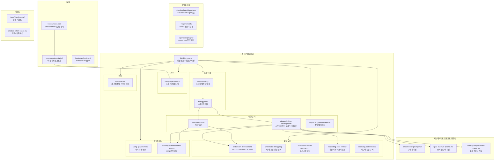
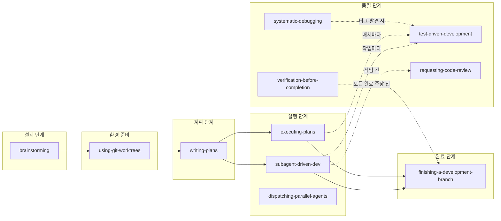
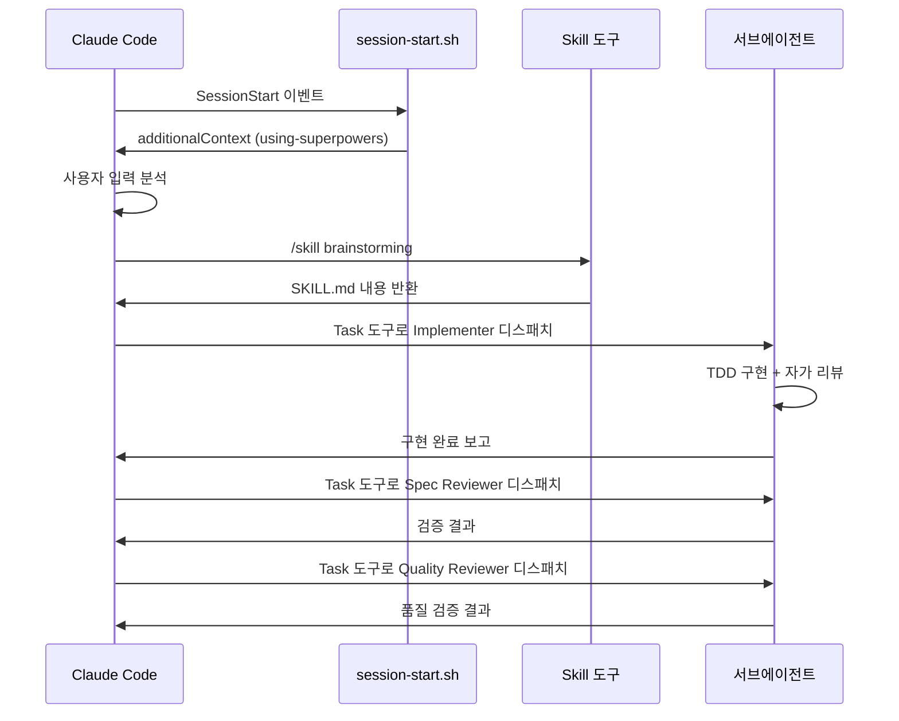

# Superpowers — Architecture

## 모듈 구조



## 스킬 의존성 그래프



## 설계 패턴 분석

### 1. Document-as-Code 패턴

Superpowers의 가장 독특한 설계 결정: **프로세스 문서가 곧 실행 가능한 코드**다.

```
전통적 접근:
  코드 → 라이브러리 import → 함수 호출 → 동작

Superpowers 접근:
  Markdown 문서 → 에이전트 로드 → 지침 따르기 → 동작
```

**이점**:
- 사람과 에이전트 모두 읽을 수 있음
- 버전 관리 (git) 자연스러움
- 의존성 제로
- 플랫폼 독립적

**트레이드오프**:
- 형식 검증 불가 (Markdown은 자유 형식)
- 에이전트의 해석에 의존 (정확한 실행 보장 불가)
- CSO 문제 (description 최적화 필요)

### 2. Shadowing/Override 패턴

개인 스킬 → 기본 스킬 계층으로 프로젝트별 맞춤을 가능하게 한다.

**`lib/skills-core.js:108-140`**:

```
해석 순서:
1. "superpowers:" 프리픽스? → 기본 스킬만 검색
2. 개인 스킬 디렉토리 확인 → 있으면 사용 (섀도잉)
3. Superpowers 스킬 디렉토리 확인 → 있으면 사용
4. 없으면 null 반환
```

**활용 사례**:
- 프로젝트 특화 TDD 규칙 (예: 특정 테스트 프레임워크 강제)
- 조직별 코드 리뷰 체크리스트
- `superpowers:brainstorming`으로 원본 강제 접근

### 3. Progressive Disclosure 패턴

토큰 효율성을 위한 정보 계층화 전략이다.

```
Layer 1: SKILL.md description (YAML frontmatter)
  → 트리거 조건만, <500자
  → 에이전트가 스킬 호출 여부 결정

Layer 2: SKILL.md 본문
  → 핵심 프로세스와 규칙
  → 시작 스킬 <150단어, 일반 <500단어

Layer 3: Supporting files (reference.md, examples/)
  → 상세 레퍼런스, 예제
  → 필요할 때만 로드

Layer 4: Scripts (*.sh, *.js)
  → 실행만 하고 내용은 로드 안 함
```

**토큰 절약 기법** (`writing-skills/SKILL.md:213-267`):
- 모든 CLI 플래그 문서화 대신 `--help` 참조
- 반복 대신 다른 스킬 교차 참조 (`REQUIRED SUB-SKILL:`)
- 일반 패턴을 압축하는 예제 사용

### 4. Trust-but-Verify 패턴 (불신 기반 검증)

서브에이전트의 보고서를 신뢰하지 않고 독립적으로 검증하는 패턴이다.

**Spec Reviewer** (`spec-reviewer-prompt.md:20-35`):

```markdown
## CRITICAL: Do Not Trust the Report

The implementer finished suspiciously quickly. Their report may be
incomplete, inaccurate, or optimistic.

**DO NOT:**
- Take their word for what they implemented
- Skip reading the actual code
- Accept partial implementations
```

**Verification-before-Completion** (`verification-before-completion/SKILL.md`):

```markdown
## The Rule
어떤 긍정적 표현도 검증 명령어 실행 후에만:
- "tests pass" → 테스트 실행 결과 확인 후
- "done" → 체크리스트 완료 확인 후
- "fixed" → 수정 검증 후
```

### 5. Anti-Rationalization 패턴

에이전트(그리고 사람)이 규칙을 우회하려는 시도를 사전에 차단하는 4층 방어 체계다.

```
Layer 1: Iron Law (절대 규칙)
  "실패하는 테스트 없이 프로덕션 코드 작성 금지"

Layer 2: Common Rationalizations Table (합리화 방지)
  | "Too simple to test" | "Simple code breaks. 30 seconds." |

Layer 3: Red Flags Checklist (자기기만 방지)
  □ "지금 작동할 거예요" 생각하고 있다면 → STOP
  □ "나중에 테스트 추가" 계획이라면 → STOP

Layer 4: Letter vs Spirit (정신 강조)
  "규칙의 문자가 아닌 정신을 따르라"
```

## 플랫폼 통합 아키텍처

### Claude Code (네이티브)



### Codex (심볼릭 링크)

```
~/.agents/skills/superpowers → git clone 경로/skills/
```

- 훅 시스템 없음 → 수동 스킬 호출 필요
- 네이티브 스킬 발견으로 SKILL.md 자동 인식
- `@mention` 구문으로 서브에이전트 생성

### OpenCode (플러그인 + 심볼릭 링크)

```
~/.config/opencode/plugins/superpowers.js  → 부트스트랩 주입
~/.config/opencode/skills/superpowers      → 스킬 발견
```

- `experimental.chat.system.transform` 훅으로 부트스트랩 주입
- 에이전트 재설정 버그(#226) 회피를 위한 특별 처리
- `update_plan` 도구로 TodoWrite 매핑

---

## 배울 점

1. **Document-as-Code**: 프로세스 문서를 코드처럼 취급하면 사람과 AI 모두 접근 가능하고, 의존성 없이 모든 환경에서 동작. 단, CSO 같은 AI 특화 최적화가 필요
2. **4층 Anti-Rationalization 방어**: Iron Law만으로는 부족. 합리화 테이블 + 레드 플래그 + 정신 강조까지 겹겹이 방어해야 에이전트의 규칙 우회를 실제로 차단
3. **Progressive Disclosure로 토큰 경제성**: 모든 정보를 한 번에 로드하지 않고 필요할 때만 상세 내용을 참조하는 계층 구조. 시작 스킬 <150단어의 엄격한 제한
4. **플랫폼 독립 스킬 포맷**: Markdown + YAML frontmatter라는 최소 포맷으로 Claude Code, Codex, OpenCode 모두 지원. 핵심은 스킬 내용이지 플랫폼 바인딩이 아님

## 적용 아이디어

| Superpowers 아키텍처 | EDR AI 적용 |
|---------------------|-------------|
| Document-as-Code 스킬 | EDR 보안 분석 패턴을 Markdown 스킬로 문서화하여 AI와 분석가 모두 활용 |
| Shadowing/Override | 조직별/부서별 보안 분석 룰을 기본 룰 위에 오버라이드하는 계층 구조 |
| Progressive Disclosure | AI에게 보안 이벤트 분석 시 단계별로 컨텍스트 제공 (요약 → 상세 로그 → 원본 데이터) |
| Anti-Rationalization | AI 오탐/미탐 판단 시 합리화 방지 체크리스트 적용 ("정상 트래픽으로 보임" → "근거는?") |
| 플랫폼 독립 포맷 | AI 분석 룰을 특정 SIEM/EDR 벤더에 종속되지 않는 범용 포맷으로 정의 |
| Trust-but-Verify | AI 분석 결과를 별도 검증 에이전트가 독립적으로 확인하는 2단계 구조 |
