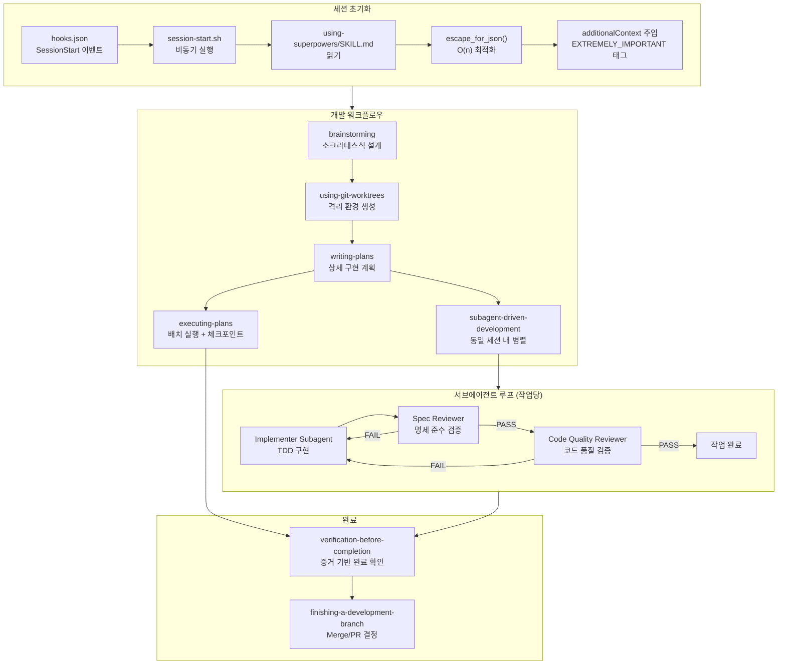
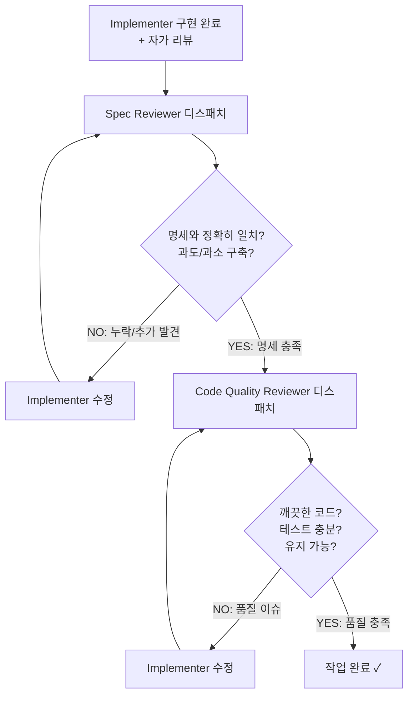

# Superpowers — Core Logic

## 전체 실행 흐름



## 핵심 알고리즘/패턴 상세 분석

### 1. 세션 초기화 — 자동 컨텍스트 주입

모든 세션이 시작될 때 `using-superpowers` 스킬이 자동으로 주입되는 메커니즘이다.

**`hooks/session-start.sh:1-47`**:

```bash
#!/bin/bash
# hooks.json의 SessionStart 이벤트로 트리거됨
# matcher: "startup|resume|clear|compact" → 모든 세션 유형에서 실행

SCRIPT_DIR="$(cd "$(dirname "$0")" && pwd)"
PLUGIN_ROOT="$(dirname "$SCRIPT_DIR")"
SKILL_FILE="$PLUGIN_ROOT/skills/using-superpowers/SKILL.md"

# 스킬 콘텐츠 읽기
SKILL_CONTENT=$(<"$SKILL_FILE")

# O(n) JSON 이스케이프 (v4.2.0 최적화)
escape_for_json() {
    local s="$1"
    s="${s//\\/\\\\}"
    s="${s//\"/\\\"}"
    s="${s//$'\n'/\\n}"
    s="${s//$'\r'/\\r}"
    s="${s//$'\t'/\\t}"
    printf '%s' "$s"
}

ESCAPED=$(escape_for_json "$SKILL_CONTENT")

# additionalContext로 주입
printf '{"hookSpecificOutput":{"hookEventName":"SessionStart","additionalContext":"<EXTREMELY_IMPORTANT>%s</EXTREMELY_IMPORTANT>"}}' "$ESCAPED"
```

**설계 포인트**:
- `async: true`로 비동기 실행 — TUI 진입을 차단하지 않음 (Windows 프리징 방지)
- `EXTREMELY_IMPORTANT` 태그로 에이전트 주의를 강제
- 모든 세션 유형(startup, resume, clear, compact)에서 실행

### 2. 2단계 검증 게이트 (Spec Compliance → Code Quality)

서브에이전트 기반 개발의 핵심 품질 보장 메커니즘이다. **순서가 절대적**이다.

**`skills/subagent-driven-development/SKILL.md:40-83`**:



**Spec Reviewer의 불신 원칙** (`spec-reviewer-prompt.md:20-35`):

```markdown
## CRITICAL: Do Not Trust the Report

The implementer finished suspiciously quickly. Their report may be
incomplete, inaccurate, or optimistic. You MUST verify everything
independently.

**DO NOT:**
- Take their word for what they implemented
- Skip reading the actual code
- Accept partial implementations
```

**순서가 절대적인 이유**: 코드가 아무리 깨끗해도 요구사항을 놓치면 무의미하다. 명세 충족이 먼저 보장되어야 코드 품질 검토가 의미를 가진다.

### 3. RED-GREEN-REFACTOR TDD 사이클

모든 코드 작성에 적용되는 절대 규칙이다.

**`skills/test-driven-development/SKILL.md:32-70`**:

```
RED: 실패하는 테스트 작성
  ├─ 1개 동작만 (한 가지씩)
  ├─ 명확한 이름
  └─ 실제 코드 사용 (mock 최소화)

  예시:
  test('retries failed operations 3 times', async () => {
    let attempts = 0;
    const operation = () => {
      attempts++;
      if (attempts < 3) throw new Error('fail');
      return 'success';
    };
    const result = await retryOperation(operation);
    expect(result).toBe('success');
    expect(attempts).toBe(3);
  });
    ↓
Verify RED: 반드시 실패해야 함
  ├─ 예상 메시지로 실패
  └─ 기능 부재로 실패 (타이포 아님)
    ↓
GREEN: 최소 코드로 통과
    ↓
Verify GREEN: 테스트 통과 확인
    ↓
REFACTOR: 정리 (테스트는 녹색 유지)
```

**The Iron Law** (`SKILL.md:31-45`):

> NO PRODUCTION CODE WITHOUT A FAILING TEST FIRST
> 코드 작성 후 테스트? → 삭제. 다시 시작.

**합리화 방지 테이블** (`SKILL.md:256-289`):

| 변명 | 현실 |
|------|------|
| "Too simple to test" | Simple code breaks. Test takes 30 seconds. |
| "Already manually tested" | Ad-hoc ≠ systematic. No record, can't re-run. |
| "Tests slow me down" | Debugging without tests slows you down more. |
| "I'll add tests later" | Later never comes. Untested code ships untested. |

### 4. Fresh Context Per Task — 서브에이전트 컨텍스트 격리

각 작업마다 완전히 새로운 서브에이전트를 디스패치하여 컨텍스트 오염을 방지하는 패턴이다.

**`skills/subagent-driven-development/implementer-prompt.md:1-78`**:

```markdown
## Task Description
[전체 작업 텍스트를 붙임 — 파일 참조 아님]

## Context
[장면 설정: 어디에 맞는가, 의존성, 아키텍처 컨텍스트]

## Before You Begin
질문들을 지금 하라 (구현 전 명확화)

## Your Job
1. 명세대로 구현
2. 테스트 작성 (TDD 따름)
3. 구현 검증
4. 커밋

## Before Reporting Back: Self-Review
- 완전성: 모든 요구사항 구현했나?
- 품질: 최고 수준 작업인가?
- 규율: YAGNI 준수? 요청한 것만?
- 테스팅: TDD 따랐나?
```

**핵심 설계 결정**:
- 작업 텍스트를 **직접 붙여넣기** (파일 참조 아님) — 서브에이전트의 파일 읽기 오버헤드 제거
- **질문-먼저 패턴** — 구현 전에 불명확한 점을 해소하여 전체 작업이 잘못 구축되는 것 방지
- **자가 리뷰** 필수 — 리뷰어가 발견할 문제를 사전 제거하여 리뷰 반복 감소

### 5. 스킬 자체의 TDD (Writing Skills)

프로세스 문서를 코드처럼 테스트 가능하게 취급하는 혁신적 접근이다.

**`skills/writing-skills/SKILL.md:1-100`**:

```
TDD 개념 → 스킬 생성 매핑:

| TDD 단계    | 스킬 생성 단계                                |
|------------|-----------------------------------------------|
| Test case  | Pressure scenario (서브에이전트로 실행)          |
| Prod code  | SKILL.md 문서                                  |
| RED        | 스킬 없이 실행 → 에이전트가 규칙 위반            |
| GREEN      | 스킬 작성 → 에이전트가 규칙 준수                 |
| REFACTOR   | 새로운 우회 방법 찾아 차단                       |
```

**Iron Law 패턴으로 허점 차단** (`skills-system.md:162-179`):

```markdown
허점 차단 전략:
1. 규칙을 명확히 명시
2. 에이전트가 시도할 수 있는 우회 방법 나열 (및 금지)
3. 레드 플래그 체크리스트 생성
4. 반대 주장이 있는 합리화 테이블 구축
5. "문자 vs 정신" 원칙 강조
```

### 6. 스킬 발견 및 네임스페이싱 (Shadowing Pattern)

개인 스킬이 기본 스킬을 오버라이드할 수 있는 계층적 발견 메커니즘이다.

**`lib/skills-core.js:108-140`**:

```javascript
function resolveSkillPath(skillName, superpowersDir, personalDir) {
    // "superpowers:" 프리픽스로 명시적 강제 가능
    const forceSuperpowers = skillName.startsWith('superpowers:');
    const actualSkillName = forceSuperpowers
        ? skillName.replace(/^superpowers:/, '')
        : skillName;

    // 개인 스킬을 먼저 확인 (섀도잉)
    if (!forceSuperpowers && personalDir) {
        const personalSkillFile = path.join(personalDir, actualSkillName, 'SKILL.md');
        if (fs.existsSync(personalSkillFile)) {
            return { skillFile: personalSkillFile, sourceType: 'personal' };
        }
    }

    // superpowers 스킬 확인
    if (superpowersDir) {
        const superpowersSkillFile = path.join(superpowersDir, actualSkillName, 'SKILL.md');
        if (fs.existsSync(superpowersSkillFile)) {
            return { skillFile: superpowersSkillFile, sourceType: 'superpowers' };
        }
    }
    return null;
}
```

**우선순위**: 프로젝트 스킬 > 개인 스킬 > Superpowers 스킬

### 7. Claude Search Optimization (CSO)

에이전트가 스킬 description만 읽고 전체 문서를 무시하는 문제를 해결하는 패턴이다.

**`skills/writing-skills/SKILL.md:161-172`**:

```yaml
# ❌ BAD: 워크플로우 요약 (Claude가 이것만 따름)
description: Use when executing plans - dispatches subagent per task
             with code review

# ✅ GOOD: 트리거 조건만 (Claude가 전체 SKILL.md를 읽게 유도)
description: Use when executing implementation plans with independent
             tasks in the current session
```

**핵심 통찰**: description이 워크플로우를 요약하면, Claude가 그 짧은 설명만 따르고 전체 SKILL.md의 상세 지침을 읽지 않는다. 트리거 조건만 기술하면 Claude가 "어떻게 해야 하는지"를 알기 위해 전체 문서를 읽게 된다.

---

## 배울 점

1. **2단계 검증의 순서 절대성**: Spec Compliance를 먼저 통과시킨 후에만 Code Quality를 검토하는 것은 "올바른 것을 만들고 있는가?"를 "잘 만들고 있는가?"보다 우선시하는 원칙. 순서를 바꾸면 깨끗하지만 잘못된 코드가 통과된다
2. **합리화 방지 테이블**: 에이전트(그리고 사람)이 규칙을 우회하려 시도하는 패턴을 사전에 예측하고 반박을 준비하는 체계. 규칙만으로는 부족하고, 우회 시도 자체를 차단해야 한다
3. **Fresh Context = 고품질 독립 판단**: 서브에이전트에 새 컨텍스트를 부여하면 이전 작업의 편향 없이 현재 작업에만 집중. 특히 리뷰어는 구현자의 보고서를 불신해야 한다
4. **토큰 효율성을 위한 Progressive Disclosure**: 시작 스킬 <150단어, 일반 스킬 <500단어. 상세 내용은 별도 파일에 두고 필요할 때만 로드

## 적용 아이디어

| Superpowers 패턴 | EDR AI 적용 |
|------------------|-------------|
| 2단계 검증 게이트 | AI 보안 분석을 "탐지 정책 준수 여부" → "분석 품질/정확도" 순서로 자동 검증 |
| Iron Law + 합리화 방지 | "로그 증거 없이 위협 판단 금지" 규칙 + "패턴이 익숙해서" 같은 우회 시도 차단 |
| Fresh Context Per Task | 보안 이벤트별 독립 분석 세션으로 이전 판단의 확증편향 방지 |
| CSO 패턴 | AI 분석 프롬프트에서 "무엇을 하라"가 아닌 "언제 이 분석을 적용하라"로 기술 |
| 스킬 TDD | AI 분석 룰을 "룰 없이 분석(RED) → 룰 적용(GREEN) → 오탐 패턴 차단(REFACTOR)"으로 검증 |
